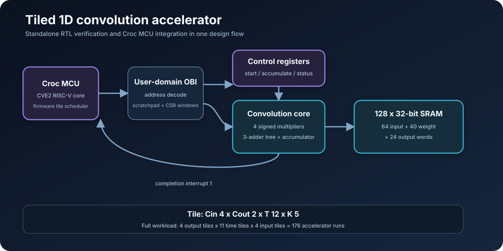
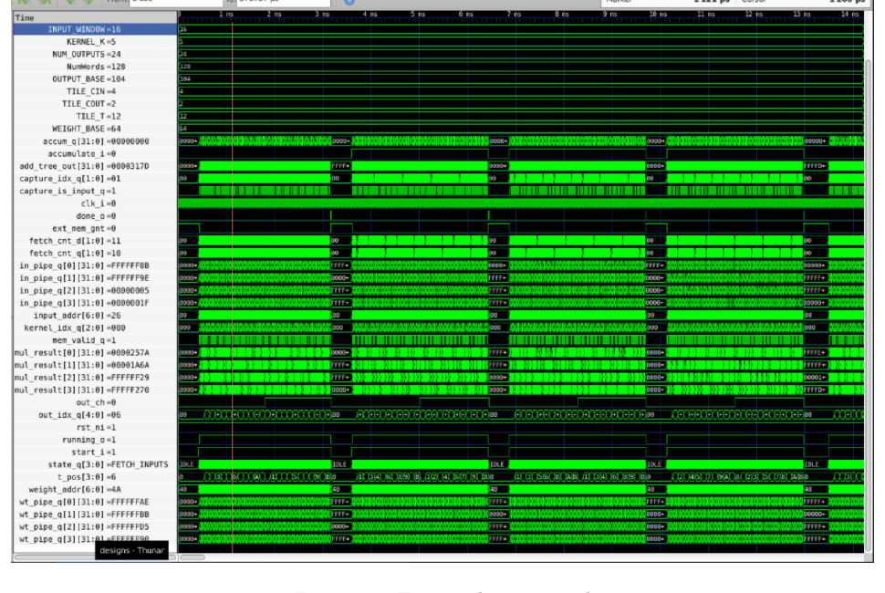
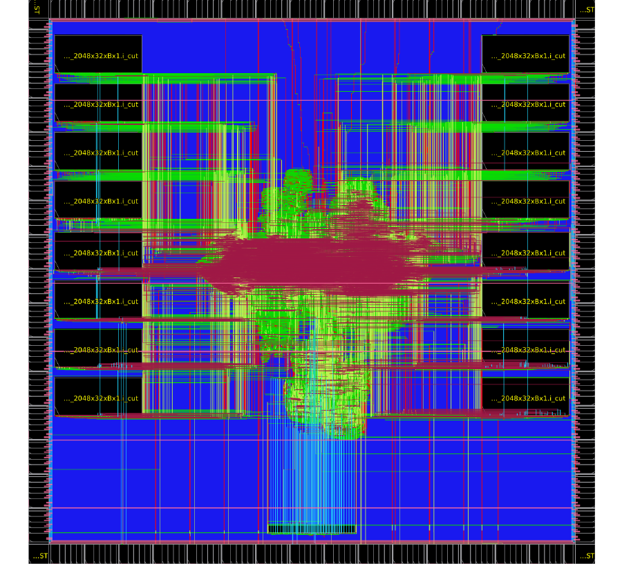

# Tiled 1D Convolution Accelerator in a RISC-V MCU

This project implements a memory-mapped 1D convolution accelerator and integrates it into the Croc RISC-V MCU. The SystemVerilog core uses four parallel signed multipliers, an adder tree, and a 128 x 32-bit scratchpad to process `Cin=4`, `Cout=2`, `T=12`, `K=5` tiles. Firmware extends the design to a 16-input-channel, 8-filter, 128-sample workload through 176 accelerator invocations. The repository combines the standalone accelerator, SoC integration, firmware, and IHP SG13G2/OpenROAD implementation scripts as one RTL-to-physical-design project.

[Technical report](output/pdf/lab3-report.pdf)



## Architecture

| Item | Implementation |
| --- | --- |
| Datapath | Four parallel signed multipliers, three-adder reduction tree, 32-bit accumulator |
| Local storage | 128 x 32-bit single-port SRAM (512 B) |
| Tile | 4 input channels x 2 output channels x 12 output positions, fixed kernel length 5 |
| Scratchpad layout | 64 input words + 40 weight words + 24 output words |
| Control | `start`, `accumulate`, `running`, and `done` registers; completion interrupt |
| SoC interface | OBI scratchpad window plus a separate register window |

Inputs and weights are signed 8-bit values, sign-extended and stored one value per 32-bit scratchpad word. For each output and kernel position, the core reads four inputs and four weights, evaluates four products in parallel, reduces them through the adder tree, and adds the result to the running partial sum. `accumulate=0` starts a new input-channel reduction; `accumulate=1` reads the previous output and continues it.

The 128-word memory is filled exactly by one tile:

```text
words   0..63    inputs   [4 channels][16 samples]
words  64..103   weights  [2 filters][4 channels][5 taps]
words 104..127   outputs  [2 filters][12 positions]
```

## Full-workload tiling

The standalone testbench is configured for 16 input channels, 128 samples per channel, 8 filters, kernel length 5, unit stride, and no padding. It produces 124 positions per filter, or 992 output words. The scheduler decomposes this into:

```text
4 output-channel tiles x 11 time tiles x 4 input-channel tiles = 176 runs
```

The first input-channel tile for each output/time tile overwrites the output; the remaining three runs accumulate partial sums.

## Verification evidence

| Observation | Verified value | Evidence |
| --- | ---: | --- |
| Accelerator start assertions | 176 | Saved full-run VCD |
| Accelerator done assertions | 176 | Saved full-run VCD |
| Overwrite runs | 44 | `accumulate=0` at start |
| Accumulation runs | 132 | `accumulate=1` at start |
| Overwrite start-to-done latency | 1,369 simulation clock cycles | 44/44 runs |
| Accumulation start-to-done latency | 1,417 simulation clock cycles | 132/132 runs |

The VCD clock has a two-unit period under a `1 ps` simulation timescale. The latency values above are cycle counts, not physical timing measurements. The trace verifies the complete tile schedule and completion behavior; the Lab 3 report records zero mismatches across all 992 output values. Machine-readable results are available in [`results/`](results/README.md).



## End-to-end and implementation results

| Stage | Result | Source |
| --- | ---: | --- |
| Standalone full-run duration | 288,369 testbench clock cycles | Saved VCD and Lab 3 report |
| Standalone golden comparison | 0 mismatches / 992 outputs | Lab 3 report console output |
| SoC hardware path | 514,400 `mcycle` cycles | Lab 3 report console output |
| SoC CPU path | 16,515,351 `mcycle` cycles | Lab 3 report console output |
| Hardware/CPU cycle ratio | 32.106x | Cycle-count calculation |
| Yosys total logic area | 785,736 um²; 56,849 cells | Lab 3 synthesis table |
| OpenROAD active area | 5.87 mm² | Lab 3 final report |
| OpenROAD power estimate | 59.2 mW at 47.6 MHz | Lab 3 final report; SRAM power unavailable |
| OpenROAD timing | Setup met; 33 hold violations, worst -0.28 ns | Lab 3 timing report |

## Croc MCU integration

The second stage places the accelerator in the Croc user domain:

- Scratchpad window: `0x2001_0000`, 64 KiB address allocation
- Control/status window: `0x2002_1000`, 4 KiB address allocation
- Completion interrupt: external interrupt index 1

The firmware driver initializes the control register, selects overwrite or accumulation mode, starts a run, and polls `done`. The application performs the same three-dimensional tiling as the standalone testbench and includes CPU, hardware, and golden-result comparison paths.

## RTL-to-layout flow

The SoC tree includes Yosys, OpenROAD, and KLayout integration for the open IHP SG13G2 process. Project-specific backend changes include a 21 ns system-clock constraint, a 128 x 32-bit logical SRAM mapping onto a 64 x 64 macro using bit interleaving, macro placement, and power-grid edits. The final OpenROAD run met setup timing and produced the layout below. It reported 33 hold violations with -0.28 ns worst slack. The 59.2 mW estimate excludes SRAM macro power because the available macro views lack power characterization.



## Repository map

| Path | Contents |
| --- | --- |
| [`accelerator/hw/`](accelerator/hw/) | Standalone accelerator RTL, OBI wrapper, register block, SRAM model |
| [`accelerator/tb/`](accelerator/tb/) | Verilator testbench, data generator, bus drivers, golden comparison |
| [`soc/rtl/user_domain/`](soc/rtl/user_domain/) | Croc user-domain integration and accelerator sources |
| [`soc/sw/applications/conv1d/`](soc/sw/applications/conv1d/) | CPU and tiled hardware convolution implementations |
| [`soc/sw/drivers/conv1d/`](soc/sw/drivers/conv1d/) | Memory-mapped accelerator driver |
| [`soc/openroad/`](soc/openroad/) | Physical-design constraints and OpenROAD scripts |
| [`soc/ihp13/`](soc/ihp13/) | IHP technology adapters and SRAM mapping |
| [`results/`](results/) | Compressed VCD and verified result summary |
| [`output/pdf/`](output/pdf/) | Lab 3 technical report |
| [`docs/provenance.md`](docs/provenance.md) | Project, supplied, generated, and third-party source boundaries |

## Reproduction

The standalone RTL can be rebuilt with Verilator, Bender, Python, and the vendored dependencies:

```bash
cd accelerator
make gen-data APP_PARAMS="--in_len 128 --in_ch 16 --k_len 5 --k_num 8 --stride 1 --padding 0"
make verilator-sim
```

The SoC simulation and physical flow require the supplied Docker environment, a RISC-V toolchain, Bender dependencies, and the IHP Open PDK. Original notices are preserved in the source tree; [`accelerator/LICENSE`](accelerator/LICENSE) and [`soc/LICENSE.md`](soc/LICENSE.md) describe the licensing of their respective starting code.
